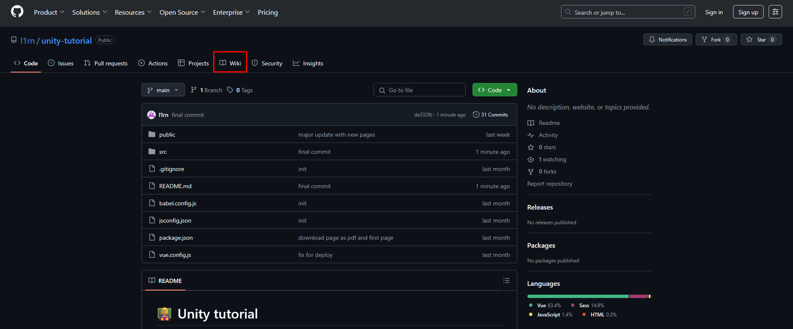

# 👩‍🏫 Unity tutorial
Сайт представляет из гайд по Unity. Здесь можно ознакомиться с моей реализацией сайта на Vue. Со всем можно ознакомиться ниже или во вкладке **Wiki** на GitHub

* * *


## 🧵 Вам понадобится

#### 1. [Node.js](https://nodejs.org/en)
#### 2. [Vue-cli](https://cli.vuejs.org/#getting-started)

## ⬇️ Установка

### 🎻 Подготовка проекта
```
npm install
```

### 🔥 Компиляция и горячая перезагрузка для разработки
```
npm run serve
```

### 🏭 Компиляция и минификация для производства
```
npm run build
```

### 😶‍🌫️ Линтинг
```
npm run lint
```

## Результат
Можно посмотреть мой деплой на Netlify — 🌍 [Unity tutorial](https://unity-tutorial.netlify.app/).
> Если сайт не работает, хост упал (30 дней не заходили)